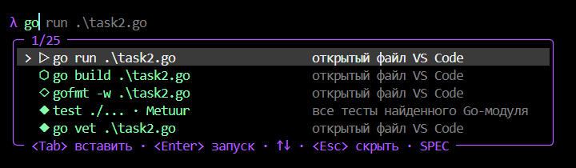

# Metuur

<p align="center">
  <strong>Умный помощник Go-команд для терминала Windows.</strong><br>
  Понимает начатую команду, открытую папку и активный файл VS Code.
</p>

<p align="center">
  <a href="https://github.com/wertyy111/Metuur/actions/workflows/ci.yml"></a>
  <a href="https://github.com/wertyy111/Metuur/releases"></a>
  <a href="LICENSE"></a>
  
  
</p>

Metuur — нативная интерактивная оболочка на Go, вдохновлённая идеями
[IRIS](https://github.com/versenilvis/IRIS) и созданная специально для Windows,
PowerShell и встроенного терминала VS Code.

## Реальный интерфейс



На изображении выше — настоящий интерфейс программы, без текстового макета.

## Что умеет Metuur

- показывает готовую команду уже во время ввода `go r`, `go bui`, `go tes` и других сокращений;
- определяет активный `.go`-файл VS Code и предлагает запустить, собрать, отформатировать или проверить именно его;
- находит реальные `main`-пакеты, тесты, вложенные `go.mod`/`go.work`, файлы и папки открытого проекта;
- понимает простые намерения: `запусти открытый файл`, `проверь все тесты`, `собери проект`;
- исправляет опечатки и случайный ввод в английской раскладке;
- знает команды `go`, `gofmt`, `goimports`, `gopls`, `dlv`, `staticcheck`,
  `golangci-lint`, `gotestsum`, `govulncheck`, `air`, `mockgen` и другие Go-инструменты;
- сохраняет постоянную PowerShell-сессию: работают `cd`, переменные, функции и aliases;
- не блокирует клавиатуру: модель вызывается асинхронно после паузы в 500 мс, старый запрос отменяется;
- автоматически запускается при открытии папки в VS Code.

## Локальное понимание намерения

Metuur использует два слоя подсказок:

1. Быстрый встроенный движок мгновенно строит корректные команды только из существующих файлов,
   пакетов и модулей проекта.
2. Маленькая локальная Qwen2.5-Coder 0.5B выбирает из этих команд ту, которая лучше всего
   соответствует написанному намерению.

Модель не может подставить выдуманный путь или опасную цепочку PowerShell: ответ принимается
только при точном совпадении с безопасной командой, которую уже подготовил Metuur. Содержимое
исходников не передаётся модели — используются только рабочая папка, путь активного файла,
имена `.go`-файлов, модуль, текущая Git-ветка и несколько последних команд.

Архитектура повторяет полезное поведение AI-подсказок IRIS: debounce, отмену устаревшего запроса,
контекст терминала и OpenAI-совместимый локальный endpoint. По умолчанию всё работает офлайн через
[llama.cpp](https://github.com/ggml-org/llama.cpp) и официальную
[Qwen2.5-Coder-0.5B-Instruct GGUF](https://huggingface.co/Qwen/Qwen2.5-Coder-0.5B-Instruct-GGUF).

## Быстрый старт

Требования: Windows 10/11, Go 1.24+ и PowerShell 5.1 или 7.

```powershell
git clone https://github.com/wertyy111/Metuur.git
cd Metuur
go build -buildvcs=false -trimpath -o .\bin\metuur.exe .\cmd\metuur
.\bin\metuur.exe
```

Важно: копируйте только команду после приглашения PowerShell. Текст `PS D:\папка>` вводить не нужно.

Для установки в `%LOCALAPPDATA%\Programs\Metuur` и добавления `metuur` в пользовательский `PATH`:

```powershell
.\scripts\install.ps1
```

## Установка маленькой модели

Один раз выполните:

```powershell
metuur ai setup
metuur ai status
```

Будут загружены переносимый Windows CPU-бэкенд llama.cpp (~18 МБ) и квантованная модель
Qwen2.5-Coder 0.5B (~409 МБ). Ollama не требуется.

Если на диске C: мало места, сразу укажите папку на другом диске:

```powershell
metuur ai setup "D:\GO project\.metuur-ai"
```

Проверить реальный ответ модели отдельно от интерфейса:

```powershell
metuur ai suggest "go tes"
metuur ai suggest "проверь все тесты"
```

## VS Code

Задача `Metuur: auto start` запускается при открытии папки. Если VS Code спросит разрешение,
выберите **Allow Automatic Tasks**.

Чтобы включить Metuur во всех новых терминалах VS Code:

```powershell
.\scripts\enable-vscode-autostart.ps1
```

После смены вкладки начните писать `go`: команда для активного файла появится первой. Если файл
не является запускаемым `package main`, Metuur предложит подходящий `main` из текущего проекта.

## Управление

| Клавиша | Действие |
|---|---|
| `Tab` / `→` | вставить выбранную подсказку |
| `Enter` | выполнить готовую команду |
| `↑` / `↓` | выбрать пункт или открыть историю |
| `Esc` | скрыть меню |
| `Shift+Tab` / `Ctrl+Space` | показать или скрыть меню |
| `Ctrl+R` | переключить `SPEC` / `HISTORY` |
| `Ctrl+Y` / `Ctrl+Shift+C` | скопировать всю строку |
| `Ctrl+C` | отменить текущий ввод |
| `Ctrl+L` | очистить экран |

## Настройка AI

```json
"ai": {
  "enabled": true,
  "provider": "portable",
  "endpoint": "http://127.0.0.1:11435/v1",
  "model": "qwen2.5-coder:0.5b",
  "dataDir": "",
  "debounceMS": 500,
  "timeoutMS": 5000
}
```

`dataDir` можно оставить пустым, указать вручную или переопределить переменной
`METUUR_AI_DIR`. Для собственного Ollama/OpenAI-совместимого сервера измените `provider`,
`endpoint`, `model` и при необходимости `apiKeyEnv`.

## Проверка проекта

```powershell
go test ./...
go vet ./...
go build -buildvcs=false -trimpath -o .\bin\metuur.exe .\cmd\metuur
.\bin\metuur.exe doctor
```

## Лицензия

[Metuur Free Use — No Sale License 1.0](LICENSE) разрешает бесплатно использовать,
изменять и распространять проект, но запрещает продавать исходники, бинарные файлы и изменённые
копии. Перед первой публичной публикацией изменённой версии автор проекта должен быть уведомлён.
Подробности: [русское пояснение](LICENSE-RU.md) и
[проверка совместимости с IRIS](docs/IRIS-COMPATIBILITY.md).

Из-за запрета продажи это source-available лицензия, а не OSI open source. Metuur является
самостоятельной реализацией; IRIS использован как продуктовый и архитектурный ориентир.
